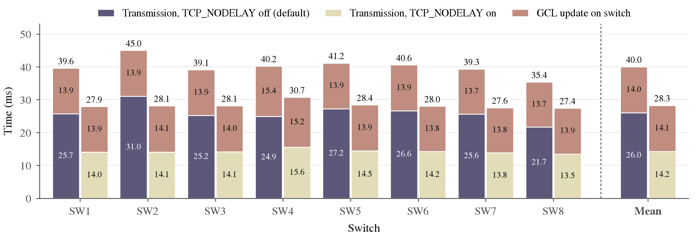

# GCL activation time per switch (2026-10-08)



`per_switch_activation.pdf` / `.png`: mean time to activate a new GCL on each switch, with the GCL
file already on the switch, for TCP_NODELAY off (default) and on.

- **Transmission (CNC → switch)**: the CNC sends the SSH command -> the switch starts running it.
- **GCL update on switch**: `tsntool st wrcl` issued -> the new GCL is live (`ConfigChangeTime`).

## Summary table

Means in ms, with the GCL file already on the switch. Per-switch values are in the chart and below;
overall means are rounded.

| | Transmission (CNC → switch) | GCL update on switch | Total |
|---|---|---|---|
| TCP_NODELAY off (default) | 26.0 (21.7–31.0) | 14.0 (13.7–15.4) | 40.0 (35.4–45.0) |
| TCP_NODELAY on | 14.2 (13.5–15.6) | 14.1 (13.8–15.2) | 28.3 (27.4–30.7) |

Ranges are the lowest and highest per-switch mean.

## Per switch

| switch | transmission, off | transmission, on | update, off | update, on | total, off | total, on |
|---|---|---|---|---|---|---|
| SW1 | 25.7 | 14.0 | 13.9 | 13.9 | 39.6 | 27.9 |
| SW2 | 31.0 | 14.1 | 13.9 | 14.1 | 45.0 | 28.1 |
| SW3 | 25.2 | 14.1 | 13.9 | 14.0 | 39.1 | 28.1 |
| SW4 | 24.9 | 15.6 | 15.4 | 15.2 | 40.2 | 30.7 |
| SW5 | 27.2 | 14.5 | 13.9 | 13.9 | 41.2 | 28.4 |
| SW6 | 26.6 | 14.2 | 13.9 | 13.8 | 40.6 | 28.0 |
| SW7 | 25.6 | 13.8 | 13.7 | 13.8 | 39.3 | 27.6 |
| SW8 | 21.7 | 13.5 | 13.7 | 13.9 | 35.4 | 27.4 |
| **Mean** | **26.0** | **14.2** | **14.0** | **14.1** | **40.0** | **28.3** |

## How it was measured

From the two runs in this folder (`immediate-nagle/`: TCP_NODELAY off, `immediate-nodelay/`:
TCP_NODELAY on), `measure_update.py --apply [--nodelay]`: 6 topologies x 3 strategies x 20
repetitions each, 9,000 port updates, every port live. Timestamps come from the CNC's `CLOCK_TAI`
and each switch's PTP `CurrentTime`, which PTP keeps within ~100 ns of each other.

- transmission = switch starts the command (`sw_a`) - CNC sends it (`t_send`), first port of each
  SSH command;
- update = `ConfigChangeTime` (`cct`) - `wrcl` issued (`sw_b`), every port. The upload of the GCL
  file is left out (the file is assumed to be on the switch already).

TCP_NODELAY turns off Nagle's algorithm on the SSH socket. With it off (paramiko's default, as in
`deploy-GCL/configure_gcl.py`), small SSH messages can wait for the switch's delayed ACK (up to
~40 ms). The remaining ~14 ms of transmission is opening the SSH channel (~1.5 ms), the switch
accepting the command (~2.7 ms) and starting a shell on the switch's CPU (~8.7 ms).

Regenerate the figure:

```bash
python3 ../../plot_update.py switches immediate-nagle immediate-nodelay
```

Other results here: `update_time_by_topology.png` and `port_update_breakdown.png` (network update
time per topology and strategy), and `immediate-*/summary.md`.
